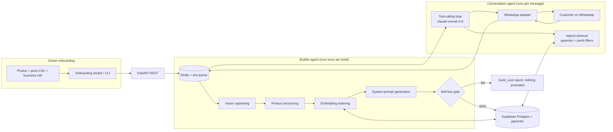

# WhatsBase

**Turn a small shop's catalog into a WhatsApp sales agent.** A business owner uploads their product photos, prices, and a few lines about the business; WhatsBase builds a per-tenant knowledge base and a grounded AI sales agent that answers their customers on WhatsApp, in Hebrew or English, with the correct photo and the real price.

Think "Base44, but the output is a WhatsApp sales agent instead of an app."

This repository contains the full system and a one-command local demo that reproduces the core exchange on a clean machine in a few minutes. See [Quickstart](#quickstart).

---

## What it does (the demo)

Once the demo tenant is built, a customer can ask, in Hebrew:

> היי, יש לכם ספה לבנה?  *(Hi, do you have a white sofa?)*

and the agent replies in Hebrew with the matching sofas, their names, and their real prices. Ask a follow-up in English ("How much is the white one?") and it answers in English with the correct price. Ask something out of scope and it declines politely and offers a human handoff. Prices and stock are never invented; they come only from the shop's catalog.

---

## Architecture

WhatsBase has two AI components that are deliberately separate. They never import each other. The database is their only interface: the Builder writes, the runtime reads. That is what makes a tenant's "agent" a row of data rather than a running process, which keeps the platform cheap to scale and instant to onboard.



- **Builder agent** (`backend/app/builder/`): an autonomous tool-calling loop. It captions photos with a vision model, structures bilingual product records, builds the tenant's embeddings, generates the tenant's system prompt and guardrails, and runs a mandatory self-test. The agent reaches `status=live` only if the self-test passes.
- **Conversation agent** (`backend/app/runtime/`): a single shared, plain tool-calling loop that serves every tenant. Per-tenant behavior comes entirely from data, scoped by `tenant_id`. Its tools are `search_products`, `get_business_info`, `send_product_cards`, and `handoff_to_human`.

A standout design point: the **self-test gate** is a built-in evaluation loop. The Builder generates its own test questions (catalog lookups, a price question, an out-of-scope question), runs them against the freshly built knowledge base, and refuses to publish an agent that fails. A broken bot never reaches a customer.

---

## Tech stack

| Layer | Choice |
|---|---|
| Backend | Python 3.12, FastAPI, Pydantic v2, SQLAlchemy 2 (async) + Alembic |
| Database | Postgres + pgvector (Supabase in production; local Postgres for the demo) |
| Queue | Redis + `arq` (async workers) |
| Conversation model | Anthropic `claude-sonnet-4-6` (native tool use, plain loop, no agent framework) |
| Vision captioning | OpenAI `gpt-4o-mini` (structured JSON) |
| Embeddings | OpenAI `text-embedding-3-large` (3072 dims, stored as `halfvec`) |
| WhatsApp | Green API, behind an adapter interface |
| Frontend | Next.js 15 (App Router) + TypeScript + Tailwind + shadcn/ui, RTL-ready |
| Observability | Langfuse (optional) |

---

## Prerequisites

- **Docker** and **Docker Compose** (for local Postgres + pgvector and Redis).
- **Python 3.12**.
- **An Anthropic API key** and **an OpenAI API key**. These are required: the models are the system.
- Optional, only for the full WhatsApp loop: a **Green API** instance id and token.
- Optional, for tracing: **Langfuse** keys.
- Node 20+ only if you want to run the web UI; the demo below reproduces the exchange without it.

---

## Quickstart

This path runs entirely on your machine. It uses a local Postgres + pgvector (no Supabase account needed) and reproduces the exchange through the backend (no WhatsApp number needed). It needs only your two API keys.

```bash
# 1. Clone
git clone https://github.com/Tentzer/WhatsBase.git
cd WhatsBase

# 2. Configure: copy the template and add your two API keys
cp .env.example .env
#   edit .env and set ANTHROPIC_API_KEY and OPENAI_API_KEY
#   (the local DATABASE_URL, REDIS_URL, and INTAKE_MODE=polling defaults already work)

# 3. Start local infrastructure (Postgres + pgvector, Redis)
docker compose -f infra/docker-compose.yml up -d

# 4. Set up the backend
cd backend
python -m venv .venv
source .venv/bin/activate          # Windows: .venv\Scripts\activate
pip install -r requirements.txt
alembic upgrade head               # create the schema (incl. pgvector)

# 5. Build the demo tenant from the seed dataset
python -m app.builder.cli --tenant demo --assets ../demo_assets
#   watch for: self-test PASSED -> agent status live

# 6. Talk to the agent (backend only, no WhatsApp)
#    Start the API and the worker in two terminals:
uvicorn app.main:app --reload --port 8000        # terminal A
arq app.intake.queue.WorkerSettings              # terminal B
```

Then reproduce the demo exchange against the running API:

```bash
curl -s http://localhost:8000/api/test-chat \
  -H "Content-Type: application/json" \
  -d '{"tenant_id":"demo","message":"היי, יש לכם ספה לבנה?"}'
```

You should get a Hebrew reply naming the matching sofas with their real prices. Try `"How much is the white one?"` for the English path, and an off-topic message to see the polite decline.

> Prefer the UI? Run the web app (`cd frontend && npm install && npm run dev`) and open the test-chat page at `http://localhost:3000`.

### One-command shortcut

A `Makefile` wraps the steps above:

```bash
make up        # docker compose: Postgres + Redis
make setup     # venv + install + migrate
make seed      # build the demo tenant
make run       # API + worker
make demo      # all of the above in order
```

(Windows without `make`: use the explicit commands in the Quickstart.)

---

## Configuration

All variables live in `.env` (template: [`.env.example`](.env.example)). The ones that matter for the local demo:

| Variable | Required for demo | Purpose |
|---|---|---|
| `ANTHROPIC_API_KEY` | Yes | Conversation agent (`claude-sonnet-4-6`). |
| `OPENAI_API_KEY` | Yes | Vision captioning + embeddings. |
| `DATABASE_URL` | Yes (default provided) | Postgres + pgvector. Default points at the local compose database. |
| `REDIS_URL` | Yes (default provided) | Queue. Default points at the local compose Redis. |
| `INTAKE_MODE` | Yes (default `polling`) | `polling` for local, `webhook` for production. |
| `TOKEN_ENCRYPTION_KEY` | Yes (default provided) | Encrypts stored WhatsApp tokens. Generate your own for any real use. |
| `GREEN_API_INSTANCE_ID`, `GREEN_API_TOKEN` | No | Only for the real WhatsApp loop. |
| `ALLOWED_TEST_NUMBERS` | No | Whitelist of phone numbers allowed to message a live demo agent. |
| `LANGFUSE_PUBLIC_KEY`, `LANGFUSE_SECRET_KEY`, `LANGFUSE_HOST` | No | Tracing. Left blank, tracing is a no-op. |
| `SUPABASE_URL`, `SUPABASE_ANON_KEY`, `SUPABASE_SERVICE_KEY` | No (for the local demo) | Auth + image Storage in the hosted setup. Not needed for the local backend demo. |

---

## Running the full WhatsApp loop (optional)

To talk to the agent from a real phone instead of the API:

1. Create a Green API instance and put its id and token in `.env`.
2. Bind the instance to the demo tenant (via the onboarding wizard's WhatsApp step, or directly).
3. Keep `INTAKE_MODE=polling` so no public URL is needed; the polling worker pulls messages.
4. Add your test phone number to `ALLOWED_TEST_NUMBERS`.
5. Message the connected number: `היי, יש לכם ספה לבנה?`

Photo delivery over WhatsApp uses image hosting (Supabase Storage in the hosted setup). The local backend demo reproduces the text behavior (retrieval, prices, language mirroring, out-of-scope decline); the full photo-over-WhatsApp path is the production configuration.

---

## Project structure

```
backend/
  app/
    core/        # config, model registry (models.py), db, supabase client, langfuse
    adapters/
      whatsapp/  # base.py (interface), green_api.py, polling.py
    builder/     # autonomous builder agent: agent.py, tools/, validation.py, report.py, cli.py
    runtime/     # conversation agent: loop.py, tools/, memory.py, guardrails.py
    retrieval/   # hybrid search over pgvector
    intake/      # webhook router, debouncer, arq tasks (queue.py, tasks.py)
    api/         # REST routes consumed by the frontend
  alembic/       # migrations
  tests/
frontend/        # Next.js app (wizard + test chat)
infra/           # docker-compose.yml (Postgres + Redis), .env.example, deploy configs
demo_assets/     # seed dataset: furniture photos, price CSV, business info
SPEC.md          # product source of truth
```

---

## Testing

```bash
cd backend
pytest tests
```

The tests that matter cover the parts most likely to break silently: adapter message normalization, the debouncer, retrieval tenant-filtering, builder idempotency, and the self-test validation gate. Keep them green.

---

## Deployment

Production runs on Railway (the API service, the `arq` worker, and Redis) with `INTAKE_MODE=webhook`, and Vercel for the frontend. Postgres + pgvector and Storage are on Supabase. Secrets come from environment variables; never commit keys (stored WhatsApp tokens are encrypted at rest).

---

## Troubleshooting

- **The bot answers a price as 0, or says it does not understand a price question.** The price did not reach the agent. Check `SELECT name_en, price FROM products WHERE tenant_id = '<tenant>';` first. If price is null or 0 there, the catalog did not ingest correctly (often a CSV column-name mismatch); fix the source and rebuild. If `products.price` is correct but the agent still says 0, your embeddings carry stale prices: a full rebuild (stage then swap) refreshes them, whereas an incremental build only adds new products.
- **"What is your price range?" gets no answer.** Range and other catalog-wide questions are aggregates, not product lookups, so similarity search has nothing to match. They need a dedicated catalog-summary tool, not `search_products`.
- **Replies contain stray `*` or `-` characters.** The model is emitting Markdown, which WhatsApp does not render. Instruct the agent in its system prompt to write plain, friendly WhatsApp text with no Markdown. Note that a live agent's prompt is frozen at build time, so rebuild the tenant after changing the prompt template.
- **The bot does not respond at all.** Check `whatsapp_instances.status` and `intake_mode`. In polling mode, verify the polling worker is running; then check Redis and the `arq` queue.
- **`vector` / `halfvec` errors at migration time.** The embedding model is 3072 dimensions, stored as `halfvec` so an HNSW index can be built at native dimensions. Ensure the pgvector extension is enabled (the compose database enables it on first start).

---

## Notes and limitations

- This is a proof of concept built for a final project. It needs your own Anthropic and OpenAI keys to run.
- The local Quickstart reproduces the core gradeable behavior (correct retrieval, real prices, Hebrew and English, out-of-scope decline). The full photo-over-WhatsApp experience is the hosted production configuration.
- Multi-tenant from day one: every domain table carries `tenant_id`, even though the demo uses one tenant.

---

## License

See [`LICENSE`](LICENSE). If no license file is present, all rights reserved by the authors.

## Acknowledgements

Built as a final project for the Generative AI Systems Design and Implementation course (Google and Reichman Tech School).
